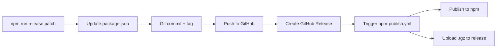

# Release Process

## Automatic Version Bumping

### Using npm scripts (recommended)

```bash
# Patch release (0.1.0 → 0.1.1) - bug fixes
npm run release:patch

# Minor release (0.1.0 → 0.2.0) - new features
npm run release:minor

# Major release (0.1.0 → 1.0.0) - breaking changes
npm run release:major
```

**What happens:**
1. ✅ Updates `package.json` version
2. ✅ Creates git commit (`chore: release vX.Y.Z`)
3. ✅ Creates git tag (`vX.Y.Z`)
4. ✅ Pushes to GitHub
5. ✅ Creates GitHub release with auto-generated notes
6. ✅ Triggers npm publish workflow

---

### Manual npm version command

```bash
# Bump version
npm version patch -m "chore: release v%s"

# Push tag and code
git push --follow-tags

# Create GitHub release
gh release create v0.1.1 --title "v0.1.1" --generate-notes
```

---

## Semantic Versioning

Follow [SemVer](https://semver.org/):

- **Patch** (0.1.x) - Bug fixes, documentation, minor improvements
- **Minor** (0.x.0) - New features, backward-compatible changes
- **Major** (x.0.0) - Breaking changes, API changes

---

## Pre-Release Checklist

Before running `npm run release:*`, ensure:

- [ ] All tests pass (`npm run test:all`)
- [ ] Lint passes (`npm run lint:check`)
- [ ] `CHANGELOG.md` is updated
- [ ] Working directory is clean (`git status`)
- [ ] You're on `main` branch
- [ ] Branch is up to date with remote

---

## Release Workflow



---

## Troubleshooting

### "Working directory is not clean"
```bash
# Check what's uncommitted
git status

# Commit or stash changes
git add .
git commit -m "chore: prepare for release"
```

### "Tag already exists"
```bash
# Delete local tag
git tag -d v0.1.0

# Delete remote tag
git push origin :refs/tags/v0.1.0
```

### "gh command not found"
```bash
# Install GitHub CLI
brew install gh

# Authenticate
gh auth login
```

---

## Examples

### Patch release (bug fix)

```bash
# Fix bug
git commit -m "fix: resolve session parsing error"

# Release
npm run release:patch
# → v0.1.0 → v0.1.1
```

### Minor release (new feature)

```bash
# Add feature
git commit -m "feat: add dark mode toggle"

# Release
npm run release:minor
# → v0.1.0 → v0.2.0
```

### Major release (breaking change)

```bash
# Breaking change
git commit -m "feat!: redesign API endpoints"

# Release
npm run release:major
# → v0.1.0 → v1.0.0
```
